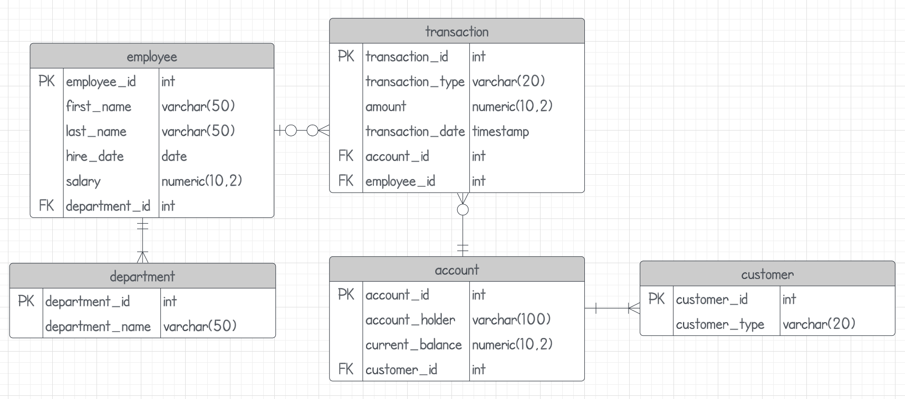

# OLTP-Banking-Database
## Description:
In this project an OLTP (Online Transaction Processing) database for a banking system is developed using `PostgreSQL`. The primary objective is to explore and demonstrate key database concepts, such as:
* Implementing transaction management with `rollbacks`
* Creating and utilizing `triggers` for automated actions
* Developing `stored procedures` to encapsulate business logic
* Enforcing `data integrity` with constraints
* Enhancing query performance through `indexing`
## Banking System Data Model
Bank legislation varies from country to country, and not all banks offer the same products and services. In this project, we consider a simple and generic data model for a banking system. This data model represents how data is stored, organized, and accessed in a database.

 

### Entities and Relationships
**Department:** This entity stores information about different departments within the organization. It has a `one-to-many` relationship with the `Employee` entity, as each department can have multiple employees.

**Employee:** This entity stores information about employees. It includes a foreign key `department_id` which references the `Department` entity, establishing a relationship that employees belong to `specific departments`.

**Customer:** This entity stores information about customers. Each customer can have multiple accounts, establishing a `one-to-many` relationship with the `Account` entity.

**Account:** This entity stores information about customer accounts. It includes a foreign key `customer_id` which references the `Customer` entity. Each account is associated with `one customer`.

**Transaction:** This entity stores information about transactions. It includes foreign keys `account_id` and `employee_id`, establishing relationships with the `Account` and `Employee` entities. Each transaction is associated with a `specific account` and processed by a `specific employee`.
